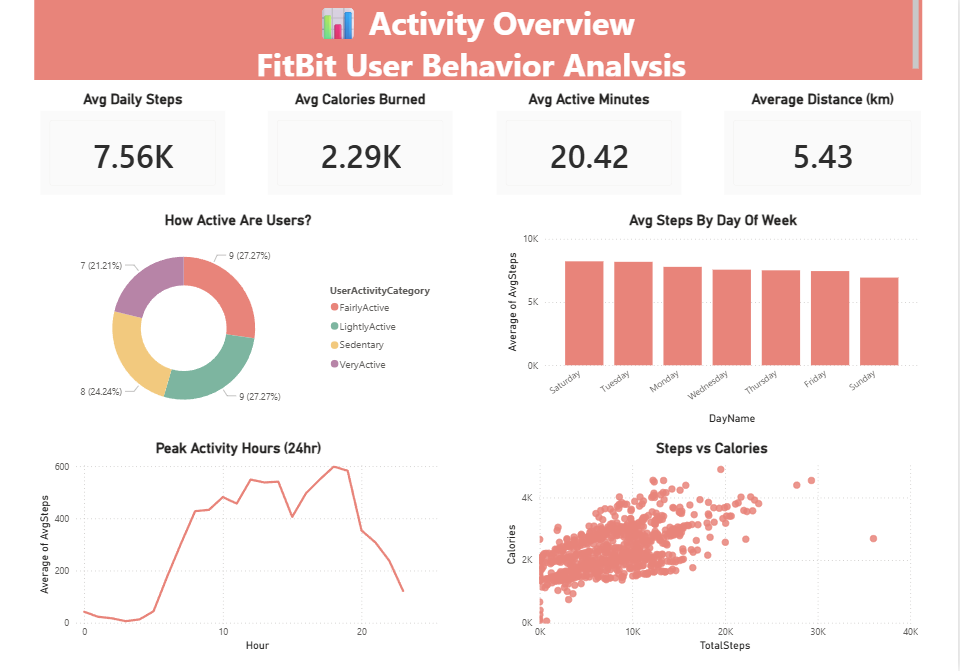
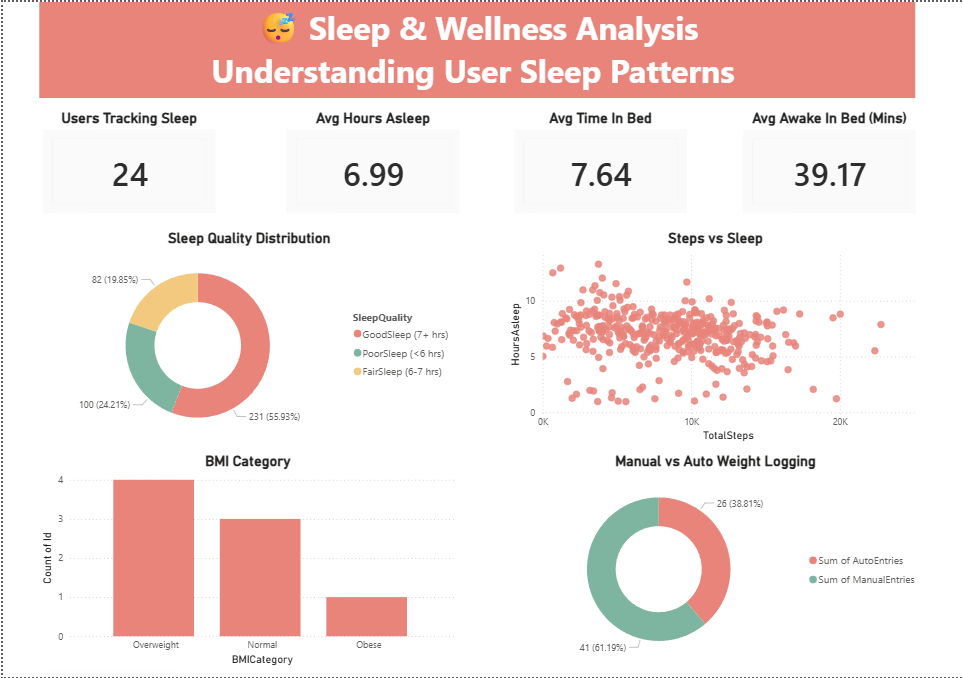
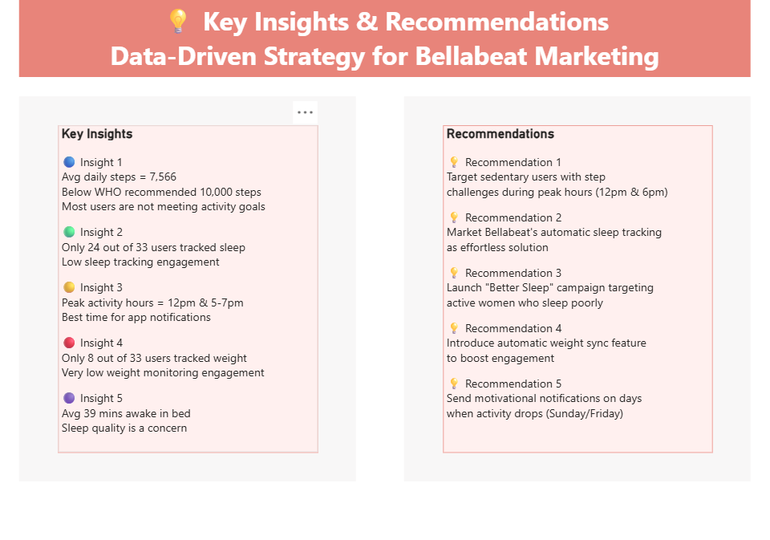

# Bellabeat Case Study 🌿

## Overview
Analyzed FitBit fitness tracker data (33 users, 31 days) 
to uncover smart device usage trends and provide 
data-driven marketing recommendations for Bellabeat — 
a women's health and wellness tech company.

## Business Questions
1. What are some trends in smart device usage?
2. How could these trends apply to Bellabeat customers?
3. How could these trends help influence Bellabeat marketing strategy?

## Tools Used
- SQL (Google BigQuery) — Data cleaning & analysis
- Power BI — Dashboard & visualization

## Dataset
- Source: FitBit Fitness Tracker Data (Kaggle)
- 33 users tracked over 31 days
- 5 tables analyzed: Daily Activity, Sleep, 
  Weight, Hourly Steps, Daily Calories

## Data Cleaning
- Removed NULL and invalid values
- Converted date columns from STRING to DATE format
- Created new calculated columns (HoursAsleep, MinutesAwakeInBed)
- Categorized users by activity level and sleep quality

## Key Insights
- Average daily steps = 7,566 (below WHO recommended 10,000)
- Only 24 out of 33 users tracked sleep (27% not tracking)
- Only 8 out of 33 users tracked weight (76% not tracking)
- Peak activity hours = 12pm & 5-7pm
- Average 39 mins awake in bed — sleep quality concern

## Recommendations
1. Target sedentary users with step challenges 
   during peak hours (12pm & 6pm)
2. Market Bellabeat's automatic sleep tracking 
   as an effortless solution
3. Launch "Better Sleep" campaign targeting 
   active women who sleep poorly
4. Introduce automatic weight sync feature 
   to boost engagement
5. Send motivational notifications on low 
   activity days (Sunday & Friday)

## Dashboard Preview
### Activity Overview

### Sleep & Wellness

### Key Insights & Recommendations

## Files
- `bellabeat_queries.sql` — All SQL queries (Exploration, Cleaning, Analysis)
- `Bellabeat_Analysis_Dashboard.pbix` — Power BI dashboard
